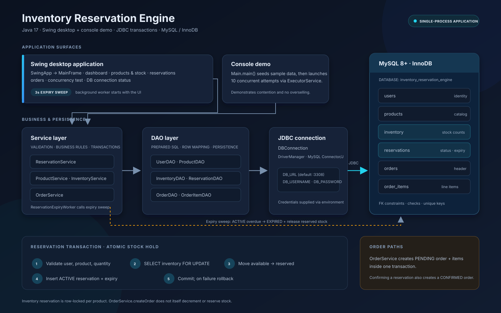

# Inventory Reservation Engine

A Java 17 console application demonstrating JDBC persistence and safe inventory reservations with MySQL transactions and row-level locks.

## Architecture



See the [full-size architecture diagram](docs/architecture.svg).

```text
Main → Service Layer → DAO Layer → DBConnection → MySQL
```

Services validate and coordinate business operations. DAOs own SQL. Reservation and order creation use explicit JDBC transactions.

## Technologies

- Java 17
- Maven
- MySQL 8+ / InnoDB
- JDBC with MySQL Connector/J
- JUnit 5 integration tests
- Core Java `ExecutorService` for the concurrency demonstration

## Database setup

Start MySQL on port `3308` (or set another `DB_URL`), then run the schema in a MySQL client:

```powershell
mysql -u your_mysql_username -p < database/schema.sql
```

The schema creates the `inventory_reservation_engine` database and six tables matching the supplied database screenshots:

| Table | Columns |
|---|---|
| `users` | `id`, `name`, `email`, `created_at` |
| `products` | `id`, `name`, `sku`, `price`, `created_at`, `description` |
| `inventory` | `product_id`, `available_qty`, `reserved_qty`, `updated_at` |
| `reservations` | `id`, `user_id`, `product_id`, `quantity`, `status`, `created_at`, `expires_at` |
| `orders` | `id`, `user_id`, `status`, `total_amount`, `created_at` |
| `order_items` | `id`, `order_id`, `product_id`, `quantity`, `unit_price` |

Tables use InnoDB, foreign keys, quantity/price constraints, a unique user email and product SKU, and one inventory row per product.

If the database already existed before this schema was added, `CREATE TABLE IF NOT EXISTS` does not alter existing tables. For the current `Unknown column 'description'` error, apply the one-time migration:

```powershell
mysql -u your_mysql_username -p < database/migrations/001_add_product_description.sql
```

This adds the nullable `description` field expected by `Product` and `ProductDAO`; it preserves existing product rows. The current `ProductDAO` also expects a `sku` column. If your existing products table does not have one, add it and assign unique values to existing rows before making it required:

```sql
ALTER TABLE products ADD COLUMN sku VARCHAR(64) NULL UNIQUE;
UPDATE products SET sku = CONCAT('SKU-', id) WHERE sku IS NULL;
ALTER TABLE products MODIFY sku VARCHAR(64) NOT NULL;
```

Set these environment variables before running the application:

```text
DB_URL=jdbc:mysql://localhost:3308/inventory_reservation_engine
DB_USERNAME=your_mysql_username
DB_PASSWORD=your_mysql_password
```

Credentials are not stored in source. If `DB_URL` is omitted, the URL above is used.

## Compile and test

From the project root:

```powershell
mvn clean compile
mvn test
```

`InventoryIntegrationTest` runs against the configured MySQL database. It is skipped by JUnit when `DB_USERNAME` or `DB_PASSWORD` is missing. Tests create uniquely named data and remove their own records. Use a development/test database for running integration tests.

## Run from IntelliJ IDEA

1. Open the folder containing `pom.xml` using **File → Open** and set the project SDK to Java 17.
2. Wait for Maven import to finish.
3. Open **Run → Edit Configurations…** and create/select an **Application** configuration with main class `com.inventory.Main`.
4. Set the environment variables above in the run configuration.
5. Run `Main.main()` using the green run icon beside the method.

The console demo creates a uniquely named Laptop and ten demo users, inserts stock of ten, and starts ten concurrent attempts to reserve two units each. It prints the successful and rejected reservation counts, remaining stock, and creates a sample order. Demo records are intentionally retained in the database.

## Reservation flow and transaction safety

`ReservationService.reserveStock(userId, productId, quantity)` validates the quantity and confirms the user and product exist. It then disables auto-commit, locks the inventory row, checks `available_qty`, subtracts the quantity from `available_qty`, adds it to `reserved_qty`, inserts an `ACTIVE` reservation, and commits. Any SQL or runtime failure triggers rollback before the connection closes.

The critical query is:

```sql
SELECT available_qty FROM inventory WHERE product_id = ? FOR UPDATE
```

The lock is held for the transaction. Concurrent transactions for the same product wait their turn and then see the committed available quantity, preventing overselling. The database row lock is the concurrency control; Java synchronization is not used to protect stock.

`OrderService.createOrder` inserts an order and its items in one transaction. The total is calculated from the supplied item quantities and unit prices; any invalid item or SQL failure rolls back the order and all item inserts.

## Example output

```text
========================================
 INVENTORY RESERVATION ENGINE
========================================
Database connected successfully.

Creating product...
Product created: Laptop ...
Adding inventory...
Initial stock: 10
Creating users...
Users created.
Starting concurrent reservation test...
Successful reservations: 5
Failed reservations: 5
Remaining available inventory: 0
Reserved inventory: 10
No overselling occurred.
```

## Project structure

```text
inventory-reservation-engine/
├── database/schema.sql
├── pom.xml
├── README.md
└── src/
    ├── main/java/com/inventory/
    │   ├── Main.java
    │   ├── model/       # Domain models and status enums
    │   ├── dao/         # PreparedStatement based persistence
    │   ├── service/     # Validation, transactions, business rules
    │   └── util/        # Environment-configured JDBC connection
    └── test/java/com/inventory/ # MySQL integration tests
```


## Current limitations

- The demo creates fresh data each run and intentionally does not clean it up.
- Order creation persists orders and line items but does not reserve/decrement stock as part of checkout.
- The project has no migration framework; apply `database/schema.sql` manually.
